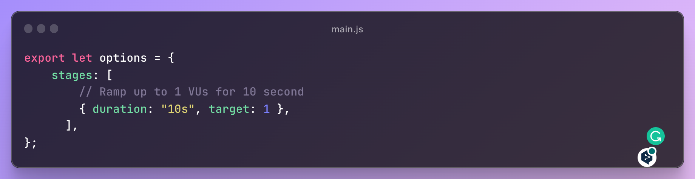
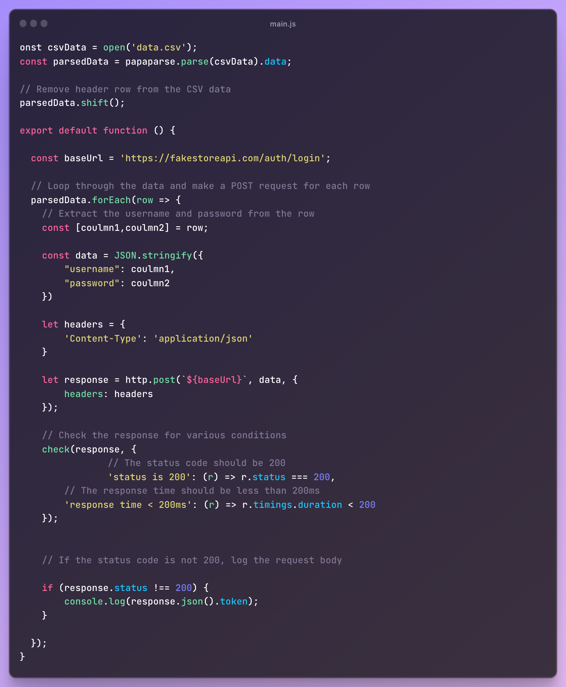

# k6-csv-load-testing

[](https://github.com/grafana/k6)

# k6-faker-load-testing

k6-csv is a small project that demonstrates how to use the CSV file with [k6](https://k6.io/), a modern load testing tool.
This project uses k6 to test the authentication of an API using CSV data. The project includes a CSV file with login credentials and a k6 script that makes POST requests to the API for each set of credentials. The script then checks the responses for various conditions, including status codes and response times.

## Getting Started

To use this framework, you need to have Node.js and k6 installed on your machine.

- Clone the Repository

```bash
> git clone https://github.com/farhanlabib/k6-csv-load-testing.git
> cd k6-csv-load-testing
> npm install
```

- Install k6

```bash
https://k6.io/docs/get-started/installation/
```
## Folder Structure

Code is structured as shown below:

```
k6-Performance-Testing-Framework/
 ├── specs                                # The k6 test file is located in the spec folder.
 │    ├──main.js                          # Main k6 Script
 │    ├──data.csv                         # CSV File File
 │
```
## Configuring the Test

The performance tests are configured using the options variable in the test script. The options variable defines the stages of the load test, including the duration and target number of requests per second for each stage.



The current configuration is set up as follows:

- Stage 1: 5 second duration and target of 1 requests per second

## Writing the Test



This main.js is a k6 performance test script that tests the login endpoint of a fake store API using data from a CSV file. The script imports the papaparse, http, and check libraries and defines the test stages, parses the CSV data, removes the header row, and makes POST requests for each row of data. The response is checked for various conditions using the check function. If the status code is not 200, the request body is logged to the console.


## Run the Test

```bash
k6 run specs/main.js
```
This command will execute the test file and provide a summary of the test results in the console.

```bash
k6 run --log-format raw specs/main.js --console-output=./test.csv 
```
This command will execute the test file and provide a detailed raw log of the test results in a csv file.

## Conclusion

This is a basic example of how to use the the CSV data with the k6 load testing tool. You can customize the test to suit your needs by changing the options and the test function.

Feel free to fork and make pull request for any additional feature.

